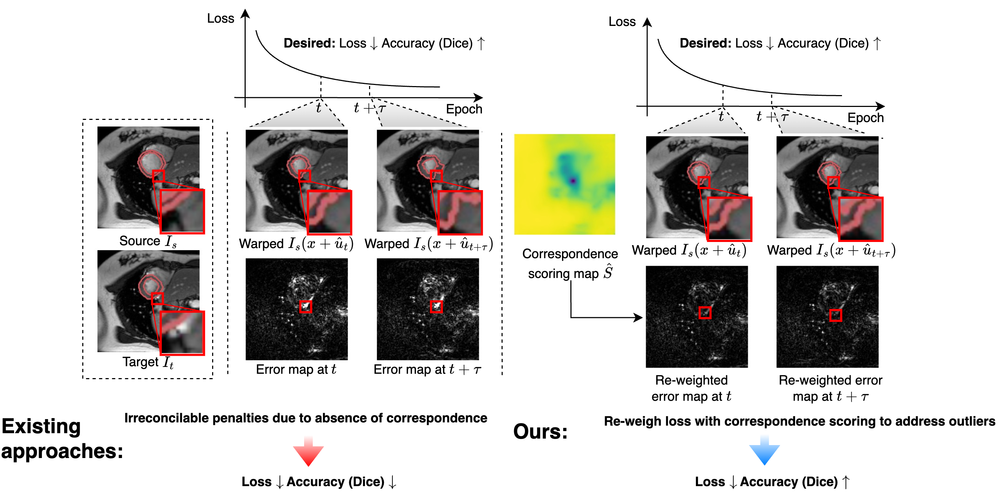
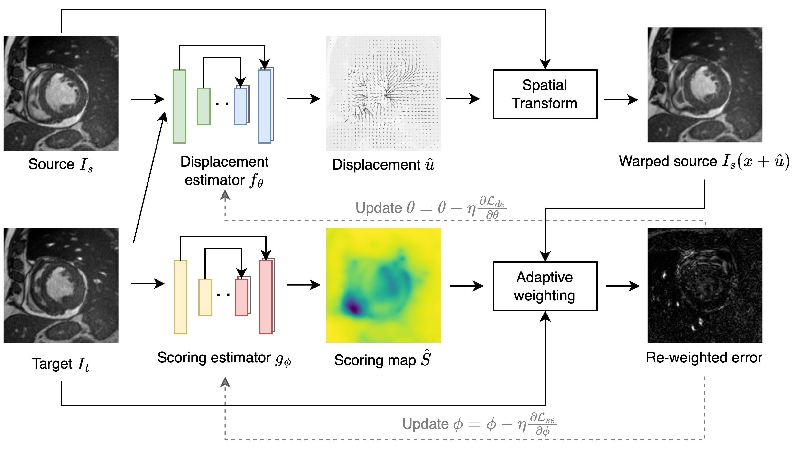

# Adaptive Correspondence Scoring for Unsupervised Medical Image Registration

## Motivation


## Framework


## Installation
Please pip install any other missing packages.
```
conda create -f requirements.yml -n AdaCS_env # Create an environment named AdaCS_env
conda activate AdaCS_env

# configure wandb
# pip install wandb==0.13.10 
```

## Dataset
Please download ACDC dataset [[website]](https://www.creatis.insa-lyon.fr/Challenge/acdc/databases.html) and CAMUS dataset [[website]](https://www.creatis.insa-lyon.fr/Challenge/camus/) from their websites.

## Default directory structure
    ├── Dataset                   
    |   ├── ACDC       # Place the downloaded dataset here
    |   |   ├── train
    |   |   ├── val
    |   |   ├── test
    |   ├── CAMUS
    |   |   ├── train
    |   |   ├── ...
    ├── Code
    |   ├── AdaCS
    |   |   ├── train_vxm.py
    |   |   ├── test_vxm.py
    |   |   ├── train_tsm.py
    |   |   ├── ...

## Train
We currently support voxelmorph-based approach for review purpose and we will open-source other architectures upon acceptance.
```
python train_vxm.py --dataset YOUR_DATASET  --bidir --model-dir YOUR_MODEL_SAVE_DIR --motion-loss-type 'wmse' --scoring-loss-type 'scoringwmse'  --warm_start --wandb-name YOUR_PROJECT_NAME 
```


## Test
```
python test_vxm.py --dataset YOUR_DATASET --test-dir '../../Dataset/ACDC/test/' --result-dir YOUR_RESULT_SAVE_DIR --model-motion YOUR_SAVED_MOTION_WEIGHT --model-scoring YOUR_SAVED_SCORING_WEIGHT --inshape 128 128
```

## Acknowledgement
We use implementation of [Voxelmorph](https://github.com/voxelmorph/voxelmorph), [Transmorph](https://github.com/junyuchen245/TransMorph_Transformer_for_Medical_Image_Registration) and [Diffusemorph](https://github.com/DiffuseMorph/DiffuseMorph).