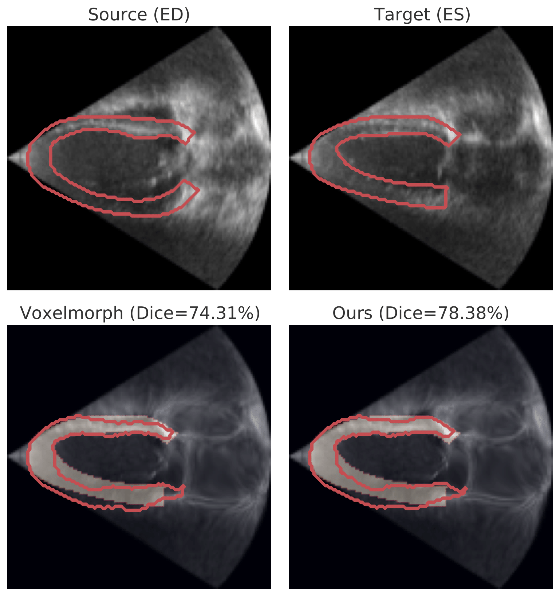

---

layout: common
permalink: /
categories: projects
---

<link href='https://fonts.googleapis.com/css?family=Roboto Slab' rel='stylesheet' type='text/css'>

<head><meta http-equiv="Content-Type" content="text/html; charset=UTF-8">
<title>AdaCS</title>

<!-- <meta property="og:image" content="images/teaser_fb.jpg"> -->

<meta property="og:title" content="TITLE">

<!-- Global site tag (gtag.js) - Google Analytics -->

<link media="all" href="./css/glab.css" type="text/css" rel="StyleSheet">

<meta content="MSHTML 6.00.2800.1400" name="GENERATOR">

<!-- <link rel="apple-touch-icon" sizes="120x120" href="/leap.png">
<link rel="icon" type="image/png" sizes="32x32" href="/leap.png">
<link rel="icon" type="image/png" sizes="16x16" href="/leap.png">
<link rel="manifest" href="/site.webmanifest">
<link rel="mask-icon" href="/leap.svg" color="#5bbad5">

<meta name="msapplication-TileColor" content="#da532c">
<meta name="theme-color" content="#ffffff"> -->
<!-- <link rel="shortcut icon" type="image/x-icon" href="leap.ico"> -->
</head>

<body data-gr-c-s-loaded="true">

<h1><strong> An Adaptive Correspondence Scoring Framework for Unsupervised Image Registration of Medical Images</strong></h1>

<h2>
    <a href="https://xiaoranzhang.com/">Xiaoran Zhang</a>&nbsp;&nbsp;&nbsp;
    <a href="https://medicine.yale.edu/profile/john-stendahl/">John C. Stendahl</a>&nbsp;&nbsp;&nbsp;
    <a href="https://seas.yale.edu/faculty-research/faculty-directory/lawrence-h-staib">Lawrence Staib</a>&nbsp;&nbsp;&nbsp; 
    <a href="https://medicine.yale.edu/profile/albert-sinusas/">Albert J. Sinusas</a>&nbsp;&nbsp;&nbsp;  
    <a href="https://vision.cs.yale.edu/members/alex-wong.html">Alex Wong</a>&nbsp;&nbsp;&nbsp; 
    <a href="https://seas.yale.edu/faculty-research/faculty-directory/james-duncan">James S. Duncan</a>&nbsp;&nbsp;&nbsp;
   </h2>
    
<h2>
        <a href="https://medicine.yale.edu/bioimaging/ipa/">Yale University</a>&nbsp;&nbsp;&nbsp; 		
    </h2>

	
<h2><a href="">Paper</a> | <a href="https://github.com/Voldemort108X/AdaCS">Code</a> </h2>

 

<!-- 
<b>TL;DR</b>: NeRF from sparse (2~5) views without camera poses, runs in a second, and generalizes to novel instances.

  -->

<h1 align="center">Overview</h1>
<table border="0" cellspacing="10" cellpadding="0" align="center">
  <tbody><tr>  <td align="center" valign="middle">
  
  </td>
      </tr></tbody></table>

  <table align=center width=800px>
                <tr>
                    <td>

  We propose an adaptive training scheme for unsupervised medical image registration. Existing methods rely on image reconstruction as the primary supervision signal. However, nuisance variables (e.g. noise and covisibility) often cause the loss of correspondence between medical images, violating the Lambertian assumption in physical waves (e.g. ultrasound) and consistent imaging acquisition. As the unsupervised learning scheme relies on intensity constancy to establish correspondence between images for reconstruction, this introduces spurious error residuals that are not modeled by the typical training objective. To mitigate this, we propose an adaptive framework that re-weights the error residuals with a correspondence scoring map during training, preventing the parametric displacement estimator from drifting away due to noisy gradients, which leads to performance degradations. To illustrate the versatility and effectiveness of our method, we tested our framework on three representative registration architectures across three medical image datasets along with other baselines. Our proposed adaptive framework consistently outperforms other methods both quantitatively and qualitatively. Paired t-tests show that our improvements are statistically significant.

</td></tr></table>

  

 

<h1 align="center">Motivation</h1>
<table border="0" cellspacing="10" cellpadding="0" align="center">
  <tbody>
  <tr>
    <td align="center" valign="middle">
      
    </td>
  </tr>
  </tbody>
</table>
<table align=center width=800px>
                <tr>
                    <td>
  

  The previous approach assumes uniform intensity constancy across the entire image, causing overfitting during training in regions with large error residuals due to the absence of correspondence as highlighted in the red box. Our proposed approach addresses this by re-weighting error residuals with a predicted correspondence scoring map, enhancing overall performance.

</td></tr></table>
  

<h1 align="center">Registration accuracy</h1>
<table border="0" cellspacing="10" cellpadding="0" align="center">
<tbody>
  <tr>
    <td align="center" valign="middle">
      
    </td>
    <td align="center" valign="middle">
      
    </td>
    <td align="center" valign="middle">
      
    </td>
  </tr>
  <tr>
    <td align="center" valign="middle">
      
    </td>
    <td align="center" valign="middle">
      
    </td>
    <td align="center" valign="middle">
      
    </td>
  </tr>
  </tbody>
</table>
<table align=center width=800px>
                <tr>
                    <td>
  

  Qualitative evaluation of our method against the second-best approach in each dataset (top two rows: ACDC and bottom two rows: CAMUS). Each block, delineated by black solid lines, features source and target images with myocardium segmentation contours. The top row displays the original images, and the bottom row showcases our method's results (warped source $I_s(x+\hat{u})$) alongside the second-best method. The yellow background indicates the ground truth ES myocardium. Dice scores are reported in the subtitles.

</td></tr></table>
 

<h1 align="center">Visualization of correspondence scoring map</h1>
<!-- <h2 align="center">Learned Geometric Knowledge</h2> -->
<table border="0" cellspacing="10" cellpadding="0" align="center">
  <td align="center" valign="middle">
      
    </td>
</table>
<table align=center width=800px>
                <tr>
                    <td>
  

  Qualitative visualization of our proposed framework in Voxelmorph architecture on ACDC (top row) and CAMUS (bottom row) validation sets. The third column exhibits successful matching, but the error map in the fourth column reveals residuals. Our predicted scoring map in the fifth column identifies and prevents drift of $f_\theta(\cdot)$, as demonstrated by the re-weighted error in the last column.

</td></tr></table>
 

<!-- <table align=center width=800px> <tr> <td> <left> -->

<h1>Citation</h1>

<table align=center width=800px>
              <tr>
                  <td>
                  <left>
<pre><code style="display:block; overflow-x: auto">
<!-- @article{jiang2022LEAP,
   title={LEAP: Liberate Sparse-view 3D Modeling from Camera Poses},
   author={Jiang, Hanwen and Jiang, Zhenyu and Zhao, Yue and Huang, Qixing},
   journal={ArXiv},
   year={2023},
   volume={2310.01410}
} -->
</code></pre>
</left></td></tr></table>

<!--  
 <table align=center width=800px> <tr> <td> <left>

<h1>Acknowledgements</h1>
 
 -->

<!-- </left></td></tr></table>
   -->

<!-- Global site tag (gtag.js) - Google Analytics -->

<!-- 

</body>
 -->

